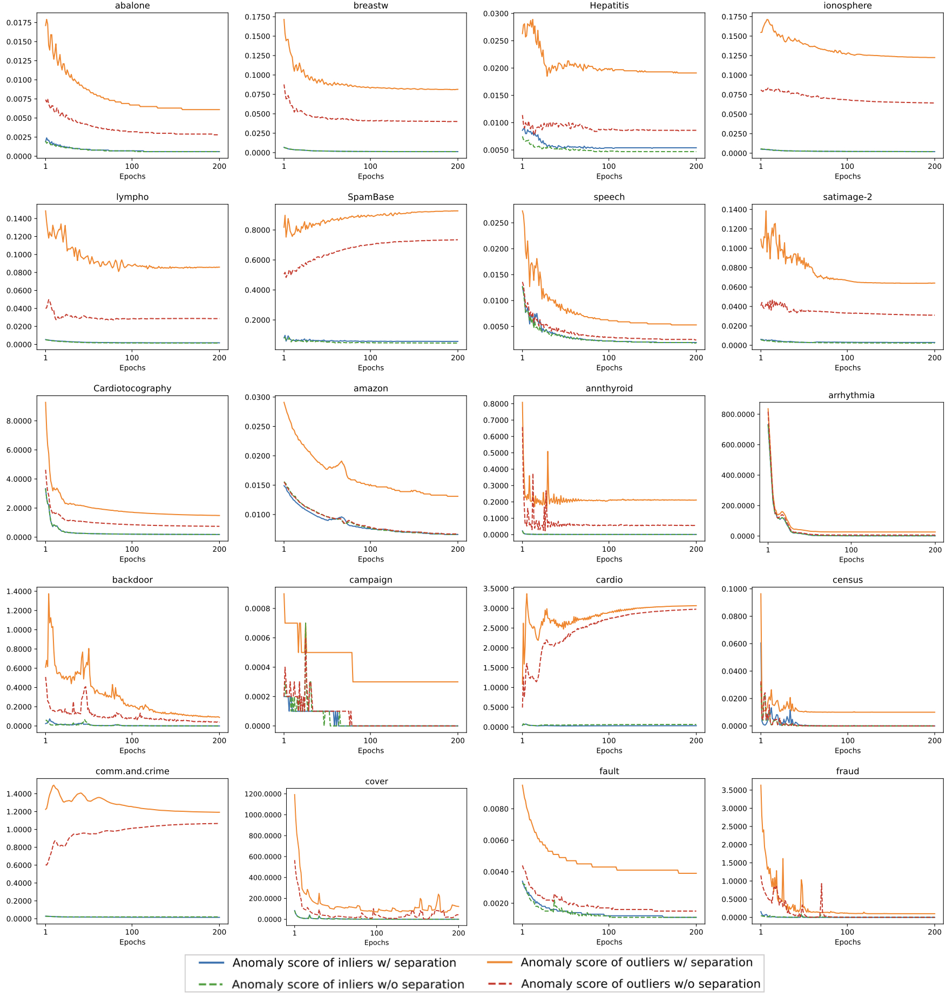
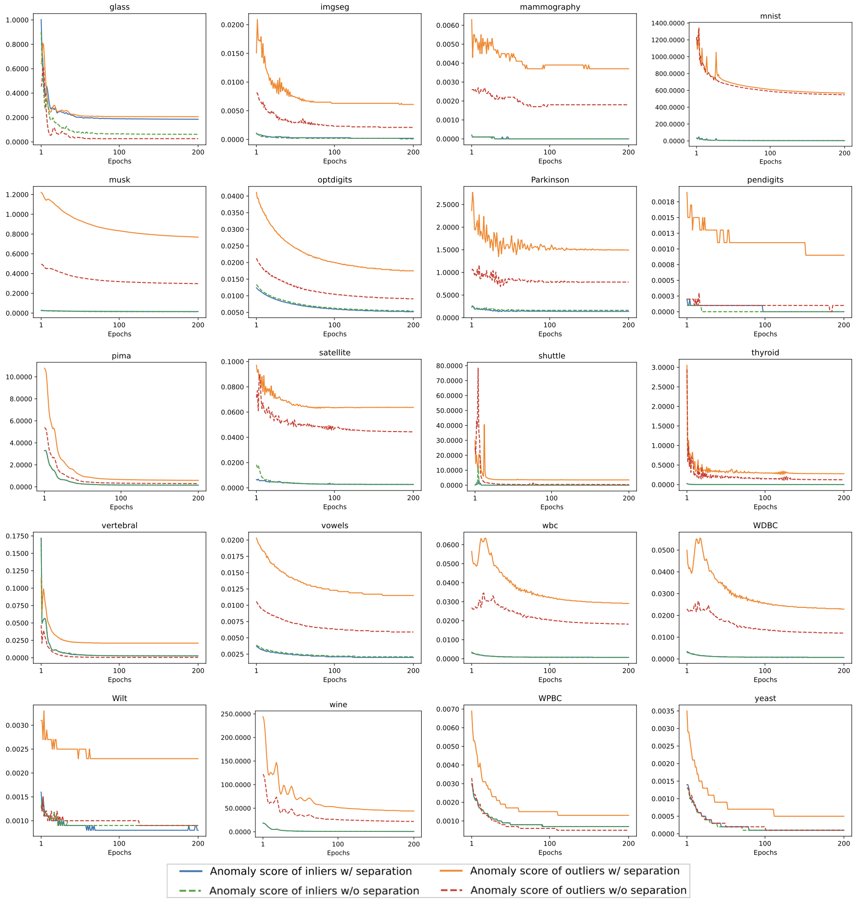

# DRL1

Extension of Fig.17 in Appendix 10 in revised paper. Visualization of test samples' anomaly score by DRL with and without separation loss as training progresses. We report the average anomaly score of normal and anomalous test samples respectively. The anomaly score is calculated by decomposition loss.

